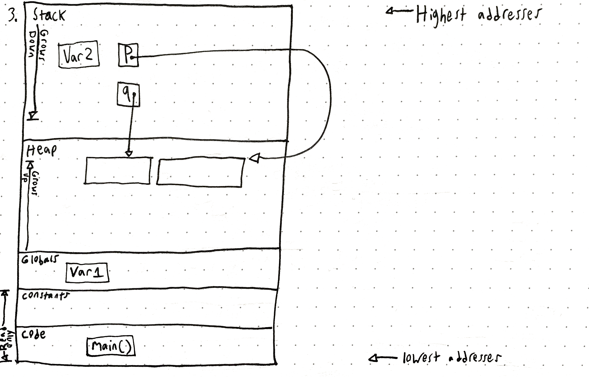

# Software Systems Exercise 2
***Sam Daitzman // 2020***

## The address space

1. The output of aspace, after some slight modifications to give me more info I was curious about, is:

```
$ gcc aspace.c -o aspace; and ./aspace                                                                                                    (base) 
Address of main is 0x109c49d80
Address of var1 is 0x109c4b018
Address of var2 is 0x7ffee5fb6858
       p points to 0x7fb7cfc018d0
       p points to 0x7fb7cfc018d0
   Address of p is 0x7ffee5fb6850
       s points to 0x109c49edc
   Address of s is 0x7ffee5fb6840
       q points to 0x7fb7cfc01950
   Address of q is 0x7ffee5fb6848
```

2. `malloc` allocates the specified `int bytes` of memory and returns a pointer to the allocated memory (or, if it fails, it returns `NULL`).

3. Here's my drawing:



4. The heap grows upwards:
```
p points to 0x7feb244018d0
q points to 0x7feb24401950
```

5. Addresses on the stack grow down:
```
Address of local is 0x7ffee9d457f8
 Address of var2 is 0x7ffee9d45858
```

0x7ffee9d45858 - 0x7ffee9d457f8 = 0x60

6. These addresses have 32 bytes between the beginning of one and the beginning of the next. I think this could mean that the minimum chunk being allocated is 32 bytes, since the amount of space I asked malloc to allocate was 17 bytes for each chunk.

```
Address of chunk1 is 0x7fcd634019d0
Address of chunk2 is 0x7fcd634019f0
```

0x7fcd634019f0 - 0x7fcd634019d0 = 0x20

## Stack allocated data
1. `stack.c` contains code intended to fill an int array with 5 ints, each of value 42. It should then print them.

2. I get the following warning: 
```
stack.c:22:12: warning: address of stack memory associated with local variable 'array' returned [-Wreturn-stack-address]
    return array;
           ^~~~~
1 warning generated.
```

3. I get some very strange results. My understanding is that the program allocates stack memory for the first array inside main, and then allocates another *different* section of memory in the stack memory allocated to `int* foo()`. Interestingly, the stack space allocated for the array created inside `int* foo()` appears to be the same stack space allocated for the later array created inside `int* bar()`.

Here's the output:
```
0x7ffeef148820
0x7ffeef148820
0
48
-283867056
32766
-283867280
```

4. After commenting out the `print` statements in `foo()` and `bar()`, here's the output:

```
0
48
-307066800
32766
-307067024
```

5. See `stack.c`.

## Adder

See `adder.c`.